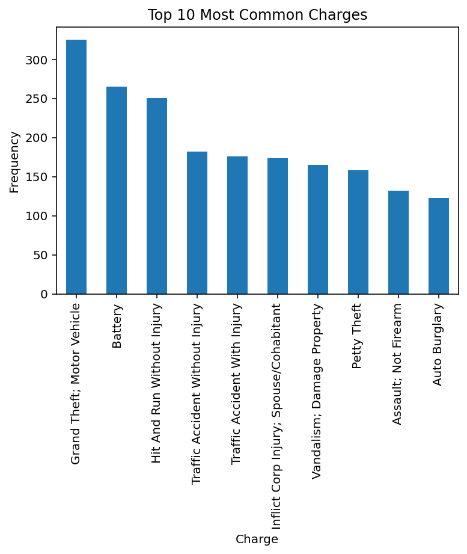
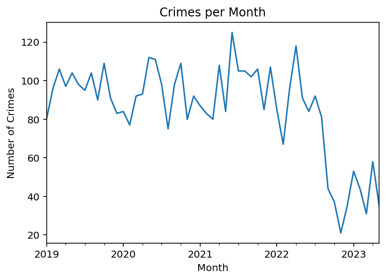
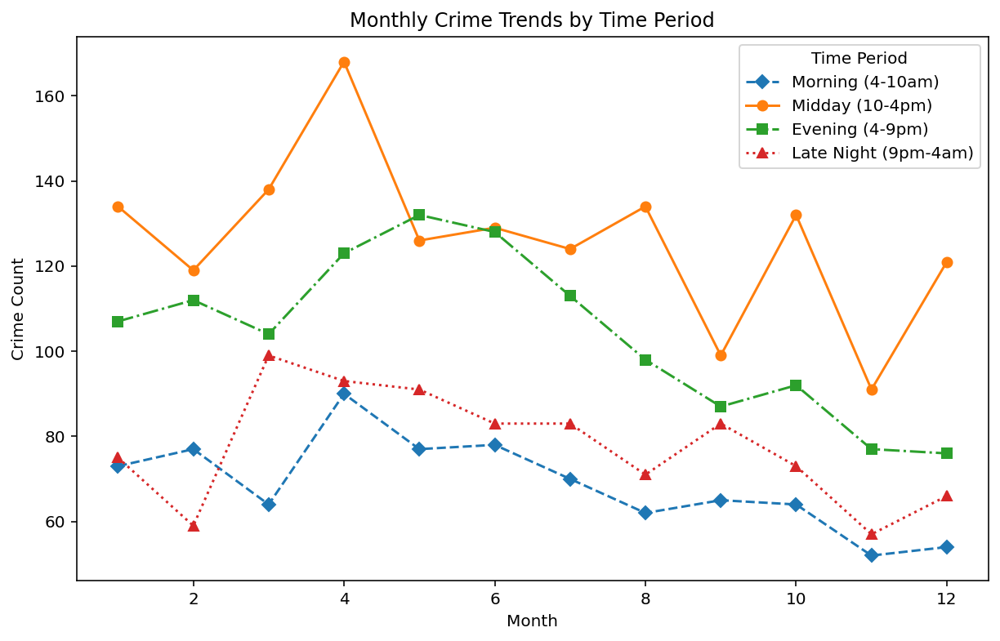
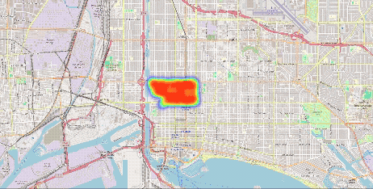
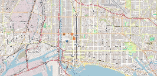

# Crime Data Analysis and Visualization

## Project Description

This project analyzes and visualizes crime data, exploring patterns over time and using clustering techniques for geospatial analysis. The dataset includes information on crime incidents such as the charges, locations, and times of occurrence.

### Key Features
- Frequency analysis of common crime charges  
- Temporal analysis of crime trends by hour, day of the week, and month  
- Geospatial analysis using heatmaps and clustering  
- Custom classification of crime data into different time periods  

---

## Data

This project uses a dataset containing crime data, with the following fields utilized for analysis:
- `REPDATETIME`: Date and time of the reported crime  
- `CHARGE_LITERAL`: Qualitative description of the charge associated with the crime  
- `LATITUDE`: Latitude coordinate of the crime location  
- `LONGITUDE`: Longitude coordinate of the crime location  

> Note: The dataset includes additional fields that were not used in this analysis.  
> The dataset must be provided by the user (not included in this repo). Place the CSV file in the project directory or update the `file_path` variable in the script.

---

## Requirements

To run this project, you will need the following Python libraries:

- pandas  
- matplotlib  
- seaborn  
- folium  

Install dependencies using pip:

```bash
pip install pandas matplotlib seaborn folium
```

---

## Usage

To clone and run the project:

```bash
# Clone the repository
git clone https://github.com/aem-iv/CrimeDataAnalysis.git

# Navigate to the project folder
cd CrimeDataAnalysis

# Run the analysis
python crime_analysis.py
```

After running the script:
- Matplotlib visualizations will display automatically.
- Geospatial maps (`crime_heatmap.html` and `crime_cluster_map.html`) will be saved to the project directory and can be opened in a web browser.

---

## Visualizations

- **Crime Frequency by Most Common Charges** — Bar plot showing the most common charges.  
- **Crime Frequency by Month** — Line chart illustrating monthly trends in reported crimes.  
- **Crime Frequency by Day** — Bar plot showing variation by day of the week.  
- **Crime Frequency by Hour** — Bar chart showing variation across hours of the day.  
- **Crime Frequency Heatmap** — Heatmap showing crime distribution by day and hour.  
- **Crime Heatmap (Geospatial)** — Map showing spatial crime density using latitude and longitude data.  
- **Crime Cluster Map (Geospatial)** — Interactive map with crime locations grouped into clusters and clickable popups.  

## Example Visualizations

**Top 10 Most Common Charges**  


**Crime Frequency by Month**  


**Crime Frequency by Hour**  


**Crime Trends by Time Period**  


---

## Interactive Map Examples

**Geospatial Crime Heatmap (GIF Preview)**  
<p align="center">
  
</p>

**Crime Cluster Map (GIF Preview)**  
<p align="center">
  
</p>

> The full interactive versions are available as HTML files:
> - `crime_heatmap.html`
> - `crime_cluster_map.html`
---

## Results & Applications

This project reveals temporal and spatial crime trends, supporting:
- **Law enforcement** in resource allocation  
- **Urban planners** in identifying high-risk zones  
- **Community programs** focused on prevention and safety  

---

## Future Improvements
Potential extensions include:
- Incorporating weather or demographic data for deeper correlation analysis  
- Building a dashboard (e.g., using Plotly Dash or Streamlit) for interactive exploration  
- Automating data updates via a public API or live feed  
